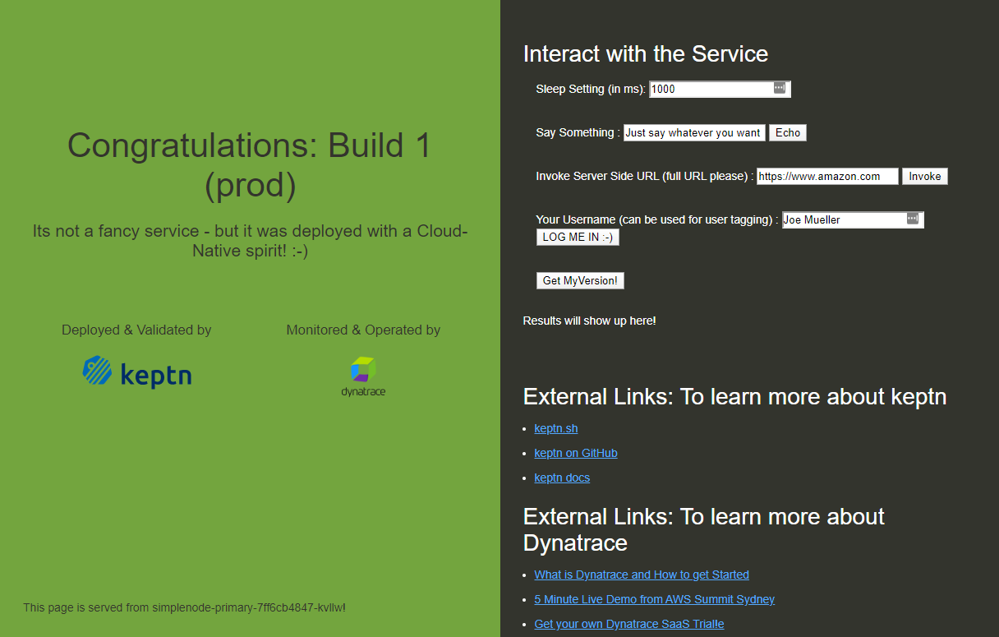
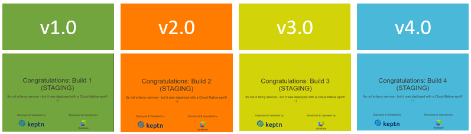

# Simplenodeservice: Node.js based sample app for Keptn

This sample app is a modified version of the Node.js sample app from the [AWS Elastic Beanstalk Tutorial](https://docs.aws.amazon.com/elasticbeanstalk/latest/dg/nodejs-getstarted.html)

I mainly use it to demonstrate continuous delivery, automated quality gates and self-healing of the Open Source project [Keptn](www.keptn.sh) as well as the monitoring capabilities of [Dynatrace](www.dynatrace.com)

## Extended Feature Set
I've modified and extended it with a couple of additional API calls such as:
* echo a string
* invoke a server-side URL and return the byte size
* "login" with a username
* get the currently running version



## 4 Builds with different behavior

I've also built-in an option to slow down server-side code execution or to simulate failed requests.
The app also comes with 4 built-in "build number" behaviors - meaning - if you launch the app and tell it to run as Build 1, 2, 3 or 4 it shows slightly different behavior. You can also launch the application in Production or Non-Production Mode:

| Build | Behavior | Dockerhub Image |
| ----- | --------- | ------------ | 
| 1 | Everything good | grabnerandi/simplenodeservice:1.0.0 |
|2|50% Failure Rate of /api/invoke| grabnerandi/simplenodeservice:2.0.0 |
|3|Everything good| grabnerandi/simplenodeservice:3.0.0 |
|4|20% Failure Rate of /api/invoke and twice as slow when running in production mode| grabnerandi/simplenodeservice:4.0.0 |

Every build shows the build number and has its own color:


### Switching builds without redeploy

Every build is based on the same source code and the actual "changed behavior" is enforced at runtime by checking which build number it is supposed to run.
When launching the 4 different versions each version in fact runs the same code but is just launched with a special environment variable that tells it which build it defaults to.
You can therefore define the build during startup
```
export BUILD_NUMBER=2
run simplenodeservice
```

or you can change it at runtime by calling a special URL
```
http://yoursimplenodeurl/api/version?newBuildNumber=2
```

## How to run it

There are different options on how to run / deploy that app. By default the port that is used is port 8080. You can however change that specifying a different value in the PORT environment variable. There are a couple of other environment variables that are important for you as they will be reflected in the UI and also decide whether the app believes it runs "in Production" or not.

| Env variable | Example values | Description |
| ------------ | -------------- | --------------- |
| PORT | 8080 | port it binds to: default is 8080 |
| DEPLOYMENT_GROUP_NAME | Production | will tell the app whether it runs in production or somewhere else | 
| NAMESPACE | Dev | This is used for display purposes in the UI |


| Run where | How | Description |
| --------- | --- | --------------------------------|
| Local     | npm start | Clone the source code repo from [simplenodeservice](https://github.com/grabnerandi/simplenodeservice) |
| Docker    | docker run -p 8080:8080 grabnerandi/simplenodeservice:1.0.0 | will expose the app on local port 8080
| k8s       | https://github.com/grabnerandi/keptn-qualitygate-examples | Follow the instructions there |

## How to run load against it

If you want to simulate some load you can either create your own load testing scripts or use browser plugins that will for instance reload the webpage to simulate load.
This example also comes with a very simply gen_load.sh bash script which uses curl to simulate load against the 4 major use cases that this app supports: Homepage, Echo, Version & Invoke. The script accepts two parameters: URL and Environment allowing you to set the URL of your app and either define "Production" or "non-production". The difference here is that "non-production" will also send the x-dynatrace-test HTTP Header which is used by Dynatrace for load testing integrations.

Here two examples to launch that script:
```
./gen_load.sh http://localhost:8080 Production

./gen_load.sh http://yoururl:8080 Staging
```

Once the script runs you can either abort it or you can create an empty file with the name endloadtest.txt. Once this file exists the script will also stop running!


## Using it with Keptn 0.7+

Here are the instructions on how to use Keptn to deploy and manage this application

### Tips for setting up Dynatrace Integration

kubectl -n keptn create secret generic dynatrace --from-literal="DT_TENANT=$DT_TENANT" --from-literal="DT_API_TOKEN=$DT_API_TOKEN"  --from-literal="DT_PAAS_TOKEN=$DT_PAAS_TOKEN" --from-literal="KEPTN_API_URL=http://$(kubectl -n keptn get ingress api-keptn-ingress -ojsonpath={.spec.rules[0].host})/api" --from-literal="KEPTN_API_TOKEN=$(kubectl get secret keptn-api-token -n keptn -ojsonpath={.data.keptn-api-token} | base64 --decode)" --from-literal="KEPTN_BRIDGE_URL=http://$(kubectl -n keptn get ingress api-keptn-ingress -ojsonpath={.spec.rules[0].host})/bridge"

### 1: Create Project & Upload Files

The Keptn folder contains a lot of supporting resource files such as the Helm Charts, SLIs, SLOs or test scripts. Please navigate into that directory before executing these commands:

```
keptn create project keptn07project --shipyard=./shipyard_keptn07.yaml
keptn onboard service simplenode --project=keptn07project --chart=./charts

// define an empty SLO.yaml so that Keptn will look for a dashboard SLO
keptn add-resource --project=keptn07project --stage=staging --service=simplenode --resource=slo_empty.yaml --resourceUri=slo.yaml
keptn add-resource --project=keptn07project --stage=prod --service=simplenode --resource=slo_empty.yaml --resourceUri=slo.yaml

// Upload Test Scripts for dev, staging & prod
keptn add-resource --project=keptn07project --stage=dev --service=simplenode --resource=jmeter/basiccheck.jmx --resourceUri=jmeter/basiccheck.jmx
keptn add-resource --project=keptn07project --stage=dev --service=simplenode --resource=jmeter/load.jmx --resourceUri=jmeter/load.jmx
keptn add-resource --project=keptn07project --stage=dev --service=simplenode --resource=jmeter/jmeter.conf.yaml --resourceUri=jmeter/jmeter.conf.yaml

keptn add-resource --project=keptn07project --stage=staging --service=simplenode --resource=jmeter/basiccheck.jmx --resourceUri=jmeter/basiccheck.jmx
keptn add-resource --project=keptn07project --stage=staging --service=simplenode --resource=jmeter/load.jmx --resourceUri=jmeter/load.jmx
keptn add-resource --project=keptn07project --stage=staging --service=simplenode --resource=jmeter/jmeter.conf.yaml --resourceUri=jmeter/jmeter.conf.yaml

keptn add-resource --project=keptn07project --stage=prod --service=simplenode --resource=jmeter/basiccheck.jmx --resourceUri=jmeter/basiccheck.jmx
keptn add-resource --project=keptn07project --stage=prod --service=simplenode --resource=jmeter/load.jmx --resourceUri=jmeter/load.jmx
keptn add-resource --project=keptn07project --stage=prod --service=simplenode --resource=jmeter/jmeter.conf.yaml --resourceUri=jmeter/jmeter.conf.yaml

```

### 2: Deploy the app

```
keptn send event new-artifact --project=keptn07project --service=simplenode --image=docker.io/grabnerandi/simplenodeservice --tag=1.0.0
keptn send event new-artifact --project=keptn07project --service=simplenode --image=docker.io/grabnerandi/simplenodeservice --tag=2.0.0
keptn send event new-artifact --project=keptn07project --service=simplenode --image=docker.io/grabnerandi/simplenodeservice --tag=3.0.0
keptn send event new-artifact --project=keptn07project --service=simplenode --image=docker.io/grabnerandi/simplenodeservice --tag=4.0.0
```

### 3: Deploy the app via events including labels

To add labels to a new-artifact we can use keptn send event with the event details in the event.json. Before executing the following command make sure to edit your configchangeevent.json and change the version to 1.0.0, 2.0.0, 3.0.0 or 4.0.0. Also update the BuildId to reflect the BuildId from the CI tool e.g: Build101, Build102, Build103, Build104

```
keptn send event --file=configchangeevent.json
```